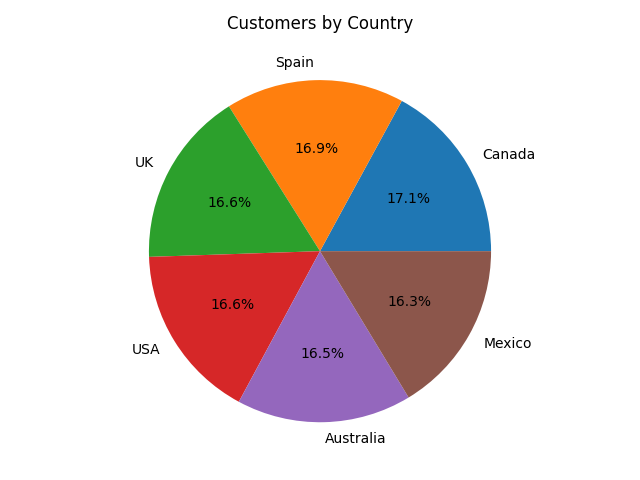
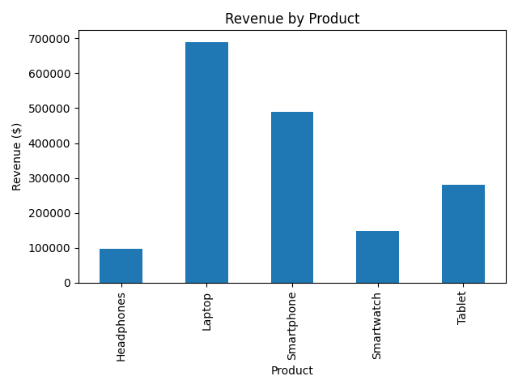

# 📊 Customer Sales Analysis with Synthetic Data

## 📌 Overview
This project demonstrates **synthetic data generation, analysis, and visualization** using Python.  
It generates a dataset of **1,500 customers**, analyzes sales trends, and produces professional charts for insights.

## 🛠️ Tools & Libraries
- **Python 3**
- **Pandas**
- **Matplotlib**
- **NumPy**

## 🔍 Features
- **Synthetic Data Generation**: Creates realistic customer sales data for testing and analysis.
- **Sales Trend Analysis**: Identifies top-selling products, country-based customer distribution, and revenue patterns.
- **Data Visualization**: Generates clear, professional charts for decision-making.

## 📊 Sample Charts

**Customers by Country**  


**Revenue by Product**  


## 🚀 How to Run
```bash
# Install dependencies
pip install pandas matplotlib numpy

# Run the analysis
python sales_analysis.py

customer-sales-analysis/
│
├── images/
│   ├── customers_by_country.png
│   ├── revenue_by_product.png
│
├── sales_analysis.py
├── README.md

Author: Marcela Aristizábal
